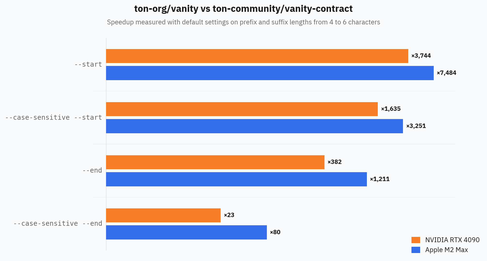

# TON Vanity

Blazingly fast vanity-address generator for TON Blockchain. Uses OpenCL and is powered by many TON-specific optimizations. Chcek out [benchmarks](#benchmarks) and [optimizations](#optimizations) as well.

## Quickstart

Just clone the repository and run `src/generator.py`:

```bash
git clone https://github.com/ton-org/vanity
cd vanity
python3 src/generator.py --owner EQBGhqLAZseEqRXz4ByFPTGV7SVMlI4hrbs-Sps_Xzx01x8G --end ABCDEF
```

You will see logs like this:

```text
Using device: [0] Apple M2 Max
Found 1, 789.96M iters/s
Found 1, 817.28M iters/s
Found 1, 824.88M iters/s
Found 2, 829.53M iters/s
Found 3, 831.91M iters/s
Found 3, 833.50M iters/s
Found 6, 834.50M iters/s
```

You can stop it at any moment, and all the found addresses will be stored in `addresses.jsonl` file.

If you look at the file, it will contain lines such as:

```json
{
   "address":"EQBSCgaA2cK7x-vKrERl84nikhPm1AbBdujoa6RlLRABCDEf",
   "init":{
      "code":"te6ccgEBAQEAUAAAnPJL-JKNCGACNDUWAzY8JUivnwDkKemMr2kqZKRxDW3Z8lTZ-vnjprzHBfLjIdTUMO1U-wTbMAAAAAAAAAAAmEQScKFrbwHa97YAdBCNCQ==",
      "fixedPrefixLength":8,
      "special":null
   },
   "config":{
      "owner":"EQBGhqLAZseEqRXz4ByFPTGV7SVMlI4hrbs-Sps_Xzx01x8G",
      "start":null,
      "end":"ABCDEF",
      "masterchain":false,
      "non_bounceable":false,
      "testnet":false,
      "case_sensitive":false,
      "only_one":false
   },
   "timestamp":1764743367.707375
}
```

* The `address` is resulting vanity address and should be taken as is from this field to also account the fixed prefix length.
* The `init` field contains `StateInit`-like object that should be used for deployment, with `code` being represented as Base64 BoC, and `fixedPrefixLength` is a proper name for legacy `splitDepth` naming from `@ton/core` library.
* The `config` field contains configurations used for generating this address.
* The `timestamp` field contains timestamp in seconds at which this address was generated.

Then you can take this line and use it for deploying any smart contract on the vanity address. The `wrappers/Vanity.ts` must be included in your project directory to work. Example for sandbox tests:

```ts
import { Blockchain, SandboxContract, TreasuryContract } from '@ton/sandbox';
import { Cell, toNano } from '@ton/core';
import { Example } from '../wrappers/Example';
import '@ton/test-utils';
import { compile } from '@ton/blueprint';
import { ContractWithVanity, Vanity } from '../wrappers/Vanity';

describe('Example', () => {
    let code: Cell;

    beforeAll(async () => {
        code = await compile('Example');
    });

    let blockchain: Blockchain;
    let deployer: SandboxContract<TreasuryContract>;
    let example: SandboxContract<ContractWithVanity<Example>>;

    beforeEach(async () => {
        blockchain = await Blockchain.create();

        const found =
            '{"address":"EQBSCgaA2cK7x-vKrERl84nikhPm1AbBdujoa6RlLRABCDEf","init":{"code":"te6ccgEBAQEAUAAAnPJL-JKNCGACNDUWAzY8JUivnwDkKemMr2kqZKRxDW3Z8lTZ-vnjprzHBfLjIdTUMO1U-wTbMAAAAAAAAAAAmEQScKFrbwHa97YAdBCNCQ==","fixedPrefixLength":8,"special":null},"config":{"owner":"EQBGhqLAZseEqRXz4ByFPTGV7SVMlI4hrbs-Sps_Xzx01x8G","start":null,"end":"ABCDEF","masterchain":false,"non_bounceable":false,"testnet":false,"case_sensitive":false,"only_one":false},"timestamp":1764743367.707375}';
        const vanity = Vanity.createFromLine(found);

        example = blockchain.openContract(
            vanity.installContract(
                Example.createFromConfig(
                    {
                        id: 0,
                        counter: 0,
                    },
                    code,
                ),
            ),
        );

        deployer = await blockchain.treasury('deployer');

        const deployResult = await example.sendDeployVanity(deployer.getSender(), toNano('0.05'));

        expect(deployResult.transactions).toHaveTransaction({
            from: deployer.address,
            to: example.address,
            deploy: true,
            success: true,
        });
    });

    it('should deploy', async () => {
        // the check is done inside beforeEach
        // blockchain and example are ready to use
    });
});
```

## Benchmarks

Generated from `tests/results.json` via `python3 scripts/chart.py`. Data comes from `npm run benchmark:print`.



## Optimizations

**A more detailed write-up on all optimizations and the process of development will be published soon.**

Key optimizations are usage of fixed prefix length for prefixes, low-level implementation of smart contract to put the salt into `code` cell so that StateInit's hash can be computed with just 2 blocks of SHA-256 per address, and iterable `special` and `fixed_prefix_length` paraters of StateInit that allow recomputing just 1 block of SHA-256 per address for most of the time.

## License

This project is licensed under the MIT License. See the `LICENSE` file for the full text.
